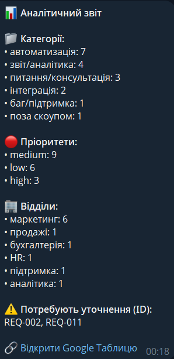
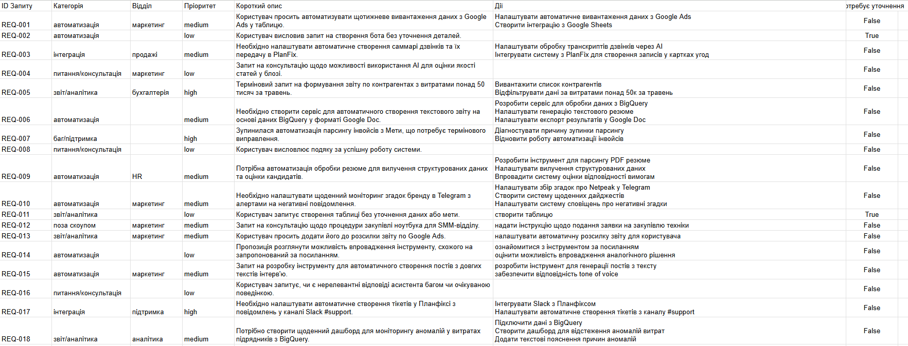

# AI Request Classification Service

Сервіс для автоматичної класифікації бізнес-запитів з використанням Google Gemini LLM та Pydantic. 
Цей інструмент приймає сирі текстові запити (з CSV файлу), використовує штучний інтелект для їх аналізу, вилучення конкретних кроків, визначення пріоритету та цільового відділу, а потім валідує відповіді через суворі схеми Pydantic. Зрештою, сервіс формує звіти та інтегрується з Google Sheets та Telegram.

## 🚀 Як запустити

### Локальний запуск (Python)

1. Клонуйте репозиторій та перейдіть у директорію проекту.
2. Встановіть залежності:
   ```bash
   pip install -r requirements.txt
   ```
3. Скопіюйте `.env.example` у файл `.env` та заповніть свої облікові дані:
   ```bash
   cp .env.example .env
   ```
4. Покладіть файл з даними `input_requests.csv` у корінь проекту.
5. (Опціонально) Додайте ваш `google_credentials.json` для інтеграції з Google Sheets.
6. Запустіть скрипт:
   ```bash
   python main.py
   ```

### Запуск через Docker

1. Зберіть Docker-образ:
   ```bash
   docker build -t ai-classifier .
   ```
2. Запустіть контейнер. Зверніть увагу, що файли `input_requests.csv` та `google_credentials.json` мають бути прокинуті всередину контейнера через volume, так само як і файл `.env`.

   **Для Linux / macOS (Bash):**
   ```bash
   docker run --env-file .env -v $(pwd)/input_requests.csv:/app/input_requests.csv -v $(pwd)/google_credentials.json:/app/google_credentials.json ai-classifier
   ```

   **Для Windows (PowerShell):**
   ```powershell
   docker run --env-file .env -v "${PWD}/input_requests.csv:/app/input_requests.csv" -v "${PWD}/google_credentials.json:/app/google_credentials.json" ai-classifier
   ```

## ⚙️ Змінні оточення (.env)
- `GEMINI_API_KEY` — Ваш ключ API для Google Gemini.
- `TELEGRAM_BOT_TOKEN` — Токен вашого Telegram бота (для сповіщень).
- `TELEGRAM_CHAT_ID` — ID чату, куди відправляти звіт.
- `GOOGLE_CREDENTIALS_FILE` — Шлях до JSON-файлу сервісного акаунту Google.
- `SPREADSHEET_ID` — ID таблиці Google Sheets.

## 🏗 Прийняті архітектурні рішення

*   **Два режими батчингу:** Для ефективного використання безкоштовних лімітів Gemini (15 RPM) реалізовано режим `economy` (групування до 5 запитів в один системний промпт). Також доступний режим `heavy` для ізольованої покрокової обробки дуже довгих запитів.
*   **Обробник помилок та Retry-логіка:** Додано вбудований цикл повторних спроб (Retry). Якщо API повертає помилку `429 RESOURCE_EXHAUSTED`, скрипт чекає 75 секунд і повторює запит, не втрачаючи дані. Якщо всі спроби вичерпано, застосовується безпечний `fallback`-словник, що гарантує безперебійну роботу скрипта.
*   **Валідація через Pydantic:** Для запобігання "галюцинацій" LLM, відповіді суворо перевіряються через схеми Pydantic. Якщо модель порушує формат, це перехоплюється блоком `try/except` без падіння системи.
*   **SDK:** Використовується новітній офіційний SDK `google-genai`, що є найкращою практикою для поточного production-оточення.

## 📸 Демонстрація роботи

**Звіт у Telegram (з підтримкою HTML та емодзі):**


**Експорт даних у Google Таблиці (з динамічним додаванням заголовків):**



